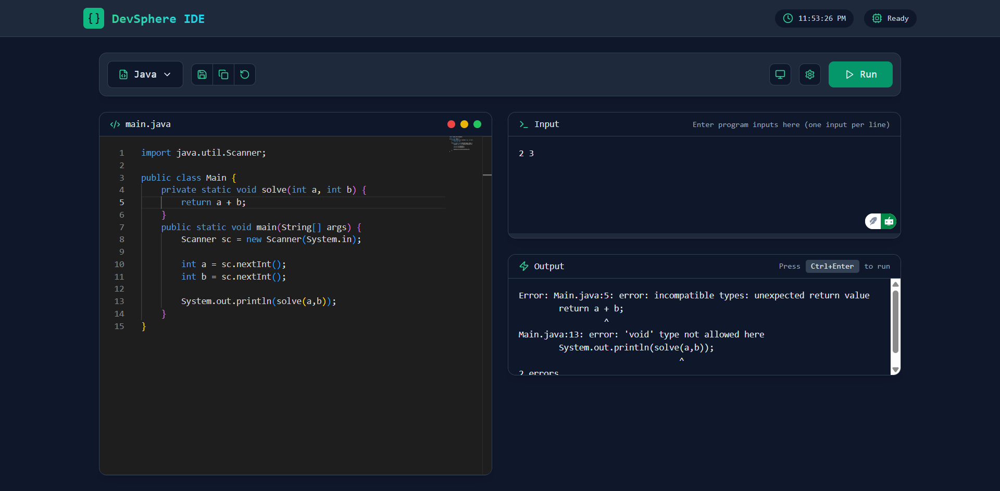
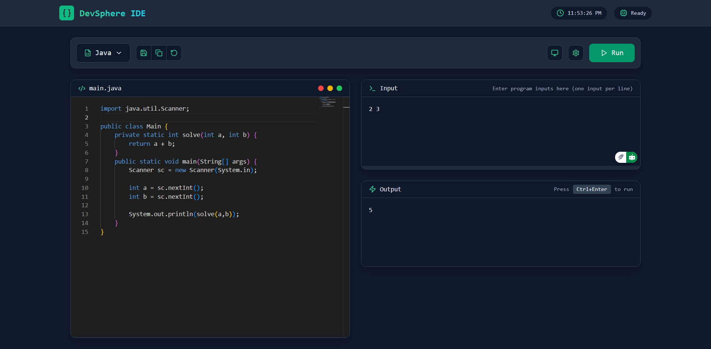

# DevSphere IDE

A modern, web-based integrated development environment (IDE) that supports multiple programming languages. DevSphere IDE provides a seamless coding experience with real-time code execution capabilities.




## Features

- 🎨 **Beautiful Modern UI** - Clean and intuitive interface with a dark theme
- 🌈 **Multi-language Support** - Write and execute code in:
  - JavaScript
  - TypeScript
  - Python
  - C++
  - Java
- ⚡ **Real-time Code Execution** - Run your code instantly with Ctrl+Enter
- 📝 **Input/Output Console** - Interactive console for program input and output
- 🎯 **Quick Actions** - Save, copy, and reset code with a single click
- 🌓 **Theme Toggle** - Switch between light and dark themes
- ⚙️ **Customizable Settings** - Adjust font size and other editor preferences
- ⌨️ **Keyboard Shortcuts** - Efficient coding with keyboard shortcuts
- 💾 **Auto-save** - Keeps your code safe with automatic saving

## Technology Stack

### Frontend
- React.js
- Monaco Editor
- Tailwind CSS
- Vite

### Backend
- Node.js
- Express.js
- Docker

## Getting Started

1. Clone the repository:
```bash
git clone https://github.com/yourusername/code-editor.git
cd code-editor
```

2. Start with Docker Compose (recommended):
```bash
docker-compose up --build
```

Or start frontend and backend separately:

### Frontend
```bash
cd client
npm install
npm run dev
```

### Backend
```bash
cd server
npm install
npm start
```

The application will be available at `http://localhost:5173` (dev) or `http://localhost:80` (production).

## Contributing

Contributions are welcome! Please feel free to submit a Pull Request.

## License

This project is licensed under the MIT License - see the LICENSE file for details.